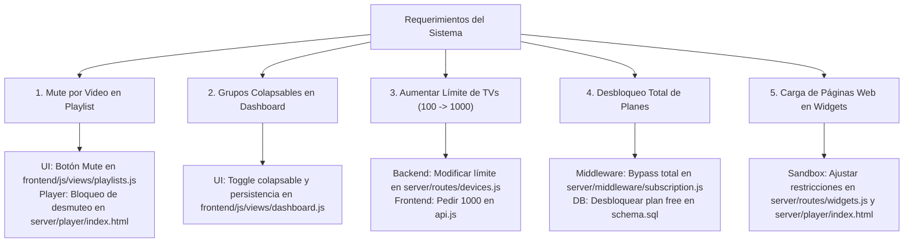

# GUÍA DE DESARROLLO Y PERSONALIZACIÓN LOCAL: SCREENTINKER

> **IMPORTANTE PARA CUALQUIER MOTOR DE IA O DESARROLLADOR:**
> 1. **REPOSITORIO 100% AISLADO Y LOCAL:** Este proyecto ha sido descargado y desacoplado por completo del repositorio original en la nube (`git remote` ha sido eliminado). **Bajo ninguna circunstancia se debe ejecutar `git pull`, `git fetch` ni actualizar contra repositorios upstream.** Toda modificación debe realizarse exclusivamente sobre los archivos locales de este directorio.
> 2. **VERSION FIJA:** Nos mantenemos estrictamente sobre esta base de código (versión base v2.2.3). Las personalizaciones nunca deben ser sobreescritas por updates externos.
> 3. **DESPLIEGUE EN DOCKER:** El proyecto cuenta con [docker-compose.yml](file:///c:/Users/BAER/Desktop/tv%20controler/docker-compose.yml) configurado con `build: .` para compilar directamente desde el código fuente local, garantizando que todos los cambios aplicados en los archivos locales se reflejen en los contenedores.

---

## 1. Arquitectura y Estructura del Proyecto

ScreenTinker es un CMS de señalización digital (Digital Signage) ligero y de alto rendimiento.

### Tecnologías Principales:
- **Backend (`/server`):** Node.js 20 con Express.
- **Base de Datos (`/server/db`):** SQLite gestionado mediante `better-sqlite3` en modo WAL (`schema.sql` y `database.js`). Todos los datos persistentes del contenedor se almacenan en el volumen `/data` (configurado mediante la variable `DATA_DIR=/data`).
- **WebSockets (`/server/ws`):** Socket.io / WebSocket para comunicación en tiempo real y telemetría de pantallas (`deviceSocket.js`).
- **Frontend Panel de Control (`/frontend`):** Aplicación Single Page Application (SPA) en JavaScript ES6 modular nativo (sin necesidad de pasos de compilación complejos como Webpack/Vite para las vistas principales).
- **Reproductor de Pantalla (`/server/player`):** `server/player/index.html` es el reproductor web universal que corre en navegadores, Smart TVs (Tizen, webOS), Android WebView y BrightSign.
- **Shared (`/shared`):** Shaders GLSL de transiciones y utilidades compartidas.

### Directorios y Archivos Clave:
- [docker-compose.yml](file:///c:/Users/BAER/Desktop/tv%20controler/docker-compose.yml): Orquestación Docker para despliegue local.
- [Dockerfile](file:///c:/Users/BAER/Desktop/tv%20controler/Dockerfile): Imagen multi-stage de producción (incluye ffmpeg y dependencias nativas).
- [server/server.js](file:///c:/Users/BAER/Desktop/tv%20controler/server/server.js): Punto de entrada del servidor, inicialización de Express y Socket.IO.
- [server/routes/devices.js](file:///c:/Users/BAER/Desktop/tv%20controler/server/routes/devices.js): API REST de gestión de pantallas.
- [server/routes/playlists.js](file:///c:/Users/BAER/Desktop/tv%20controler/server/routes/playlists.js): API REST de listas de reproducción e ítems.
- [server/routes/widgets.js](file:///c:/Users/BAER/Desktop/tv%20controler/server/routes/widgets.js): Renderizador HTML y lógica de widgets (incluyendo el widget `webpage`).
- [server/middleware/subscription.js](file:///c:/Users/BAER/Desktop/tv%20controler/server/middleware/subscription.js): Middlewares de control de planes, límites de almacenamiento y pantallas.
- [server/player/index.html](file:///c:/Users/BAER/Desktop/tv%20controler/server/player/index.html): Núcleo del reproductor que corre en los televisores.
- [frontend/js/views/dashboard.js](file:///c:/Users/BAER/Desktop/tv%20controler/frontend/js/views/dashboard.js): Vista principal del listado de pantallas y grupos.
- [frontend/js/views/playlists.js](file:///c:/Users/BAER/Desktop/tv%20controler/frontend/js/views/playlists.js): Editor visual de listas de reproducción y sus elementos.

---

## 2. Mapa Detallado de Requerimientos y Correcciones

A continuación se detalla el diagnóstico exacto y la guía de implementación para cada una de las 5 tareas solicitadas:



---

### Requerimiento 1: Mute de Videos desde el Servidor por Elemento de Playlist

#### Objetivo:
En el módulo de edición de playlists, permitir silenciar (mutear) individualmente cada video desde el panel de administración. Además, **garantizar que el video permanezca silenciado en el televisor**, impidiendo que alguien con el control remoto o interacción física en el televisor pueda activar el audio.

#### Diagnóstico Técnico:
1. **Base de Datos:** La tabla `playlist_items` ya cuenta con la columna `muted INTEGER DEFAULT 0`.
2. **Backend API:** En [server/routes/playlists.js](file:///c:/Users/BAER/Desktop/tv%20controler/server/routes/playlists.js), la ruta `PUT /api/playlists/:id/items/:itemId` ya acepta la propiedad `muted` y dispara `emitMuteChanged()`.
3. **Frontend:** En [frontend/js/views/playlists.js](file:///c:/Users/BAER/Desktop/tv%20controler/frontend/js/views/playlists.js) (función `renderItems`), cada fila de item tiene botones para programar, reemplazar, duplicar, mover y borrar, pero **no tiene un botón para alternar el estado de mute**.
4. **Player (Televisor):** En [server/player/index.html](file:///c:/Users/BAER/Desktop/tv%20controler/server/player/index.html), cuando un usuario presiona teclas de volumen o la tecla de silencio en el televisor (líneas ~2882-2889), el reproductor invierte `video.muted = !video.muted` o incrementa el volumen quitando el mute. Si el ítem viene configurado con `item.muted = 1` desde el servidor, el reproductor debe tratarlo como **mute forzado e inmutable** desde el cliente local.

#### Plan de Modificación:
1. **Frontend (`frontend/js/views/playlists.js`):**
   - En `renderItems(items)`: Añadir un botón con icono de audio (`🔊` / `🔇`) a la barra de acciones de cada ítem de tipo video o contenido multimedia.
   - Si `item.muted === 1`, mostrar el icono en estado activo/rojo/tachado.
   - En el evento `click`: invocar `api.updatePlaylistItem(currentPlaylistId, itemId, { muted: item.muted ? 0 : 1 })` y refrescar la vista.
2. **Player (`server/player/index.html`):**
   - En la lógica de reproducción (`renderVideo`, `renderLiveStream`, eventos de teclado y control remoto):
     - Si `item.muted === 1` o `item.muted === true`:
       - Asignar `video.muted = true`.
       - Agregar un listener `video.addEventListener('volumechange', () => { if (item.muted && !video.muted) video.muted = true; })` para contrarrestar cualquier intento de desmutear en el TV.
       - En los handlers de atajos de teclado/remoto (`keydown` de volumen y mute), verificar si `currentItem?.muted` está activo y en tal caso ignorar la solicitud de desmutear.

---

### Requerimiento 2: Grupos Colapsables en la Vista General de Pantallas

#### Objetivo:
En la vista principal (Dashboard / Pantallas), cuando se tienen muchas pantallas organizadas en grupos, el listado vertical se vuelve excesivamente largo. Se debe permitir colapsar y expandir cada grupo individualmente, recordando la preferencia del usuario.

#### Diagnóstico Técnico:
1. En [frontend/js/views/dashboard.js](file:///c:/Users/BAER/Desktop/tv%20controler/frontend/js/views/dashboard.js), la función `renderGroupSection(group, devices, playlists)` genera el contenedor `.group-section` con su encabezado y la cuadrícula `.device-grid`.
2. No existe estado de colapso ni clases que oculten el `.device-grid` del grupo.
3. La interacción de Drag & Drop para mover pantallas entre grupos debe seguir funcionando sin interferir con la acción de colapsar/expandir.

#### Plan de Modificación:
1. **Estado en `dashboard.js`:**
   - Mantener un `Set` con los IDs de grupos colapsados, inicializado desde `localStorage.getItem('st_collapsed_groups')`.
2. **Plantilla HTML en `renderGroupSection`:**
   - Añadir un botón toggle o chevron interactivo (`▼` / `►`) en la barra del título del grupo.
   - Añadir atributos `data-group-collapse="${group.id}"` y condicionalmente la clase `is-collapsed` o estilo `display: none` al `.device-grid` y la barra de selección del grupo si está colapsado.
3. **Manejadores de Eventos en `attachGroupHandlers`:**
   - Capturar el click en el chevron o cabecera del grupo (evitando que se dispare cuando se hace click en los desplegables de comandos o listas de reproducción).
   - Alternar la visibilidad de la cuadrícula con animación suave.
   - Guardar el estado actualizado en `localStorage`.

---

### Requerimiento 3: Aumentar el Límite de Pantallas de 100 a 1000 en la Interfaz Principal

#### Objetivo:
Actualmente el backend devuelve un máximo de 100 televisores en la consulta principal, impidiendo visualizar y configurar pantallas cuando se supera este número. Se requiere elevar este límite a 1000.

#### Diagnóstico Técnico:
1. **Backend ([server/routes/devices.js](file:///c:/Users/BAER/Desktop/tv%20controler/server/routes/devices.js), línea 28):**
   ```javascript
   const limit = Math.min(parseInt(req.query.limit) || 100, 500);
   ```
   - Si no se especifica `limit`, el valor por defecto es **100**.
   - El tope máximo permitido por el servidor está acotado con `Math.min(..., 500)`, impidiendo recibir más de 500 aunque se pidan.
2. **Frontend ([frontend/js/api.js](file:///c:/Users/BAER/Desktop/tv%20controler/frontend/js/api.js), línea 340):**
   ```javascript
   getDevices: () => request('/devices'),
   ```
   - La llamada no envía ningún parámetro `limit`, por lo que el servidor siempre aplica el límite por defecto de 100.

#### Plan de Modificación:
1. **En `server/routes/devices.js`:**
   - Actualizar el límite predeterminado y el tope superior:
     ```javascript
     const limit = Math.min(parseInt(req.query.limit) || 1000, 5000);
     ```
2. **En `frontend/js/api.js`:**
   - Actualizar la llamada a la API:
     ```javascript
     getDevices: (limit = 1000) => request(`/devices?limit=${limit}`),
     ```
3. Verificar si existen otras rutas paginadas asociadas a pantallas (como endpoints de telemetría o mesh) para asegurar que no trunquen los listados.

---

### Requerimiento 4: Verificación y Desbloqueo Total de Planes y Licencias

#### Objetivo:
Garantizar que no exista ningún tipo de restricción en cuanto a cantidad de televisores que se puedan registrar, cuota de almacenamiento, control remoto o funciones avanzadas por concepto de planes de pago ("Free", "Starter", "Pro").

#### Diagnóstico Técnico:
1. **Base de Datos (`server/db/schema.sql` y `server/db/database.js`):**
   - La tabla `plans` define por defecto:
     - `free`: `max_devices = 2`, `max_storage_mb = 500`, `remote_control = 0`, `remote_url = 0`.
     - `starter`: `max_devices = 8`.
     - `pro`: `max_devices = 25`.
     - `enterprise`: `max_devices = -1` (ilimitado), `max_storage_mb = -1`.
2. **Middlewares de Restricción ([server/middleware/subscription.js](file:///c:/Users/BAER/Desktop/tv%20controler/server/middleware/subscription.js)):**
   - `checkDeviceLimit`: Bloquea el emparejamiento de pantallas en `/api/provision/pair` y `/api/devices/web-player` si `deviceCount >= plan.max_devices`.
   - `checkStorageLimit`: Bloquea la subida de contenido en `/api/content`.
   - `checkRemoteControl`: Bloquea comandos remotos en pantallas si el plan no tiene `remote_control = 1`.
   - `checkRemoteUrl`: Bloquea URLs remotas en contenido.
   - `getUserPlan`: Degrada automáticamente cuentas vencidas a `free`.

#### Plan de Modificación:
1. **En `server/middleware/subscription.js`:**
   - Desactivar completamente las restricciones:
     - En `getUserPlan(userId)`: Retornar siempre un objeto de plan desbloqueado con permisos ilimitados:
       ```javascript
       max_devices: -1,
       max_storage_mb: -1,
       remote_control: 1,
       remote_url: 1,
       priority_support: 1,
       plan_name: 'enterprise',
       plan_display_name: 'Unlimited Local'
       ```
     - En los middlewares `checkDeviceLimit`, `checkStorageLimit`, `checkRemoteControl`, `checkRemoteUrl`: llamar inmediatamente a `next()` sin realizar chequeos restrictivos.
2. **En `server/db/schema.sql`:**
   - Actualizar el registro del plan `free` para que nazca con valores ilimitados:
     ```sql
     ('free', 'free', 'Free', -1, -1, 1, 1, 1, 0, 0, 0)
     ```
3. **En `docker-compose.yml`:**
   - Mantener `SELF_HOSTED=true` y `HIDE_BILLING=true` para ocultar menús de facturación o suscripción innecesarios en la interfaz.

---

### Requerimiento 5: Corrección de la Carga de Páginas Web en Widgets

#### Objetivo:
Actualmente, al incrustar una página web mediante un widget de tipo Webpage, la página no termina de cargar correctamente su interfaz ni sus elementos interactivos. Es necesario resolver este comportamiento.

#### Diagnóstico Técnico:
1. **Doble Aislamiento y Restricción Severa de Sandbox:**
   - **Capa 1 (Widget Render - [server/routes/widgets.js](file:///c:/Users/BAER/Desktop/tv%20controler/server/routes/widgets.js), función `renderWebpage`, línea 885):**
     ```html
     <iframe src="${escapeHtml(url)}" sandbox="${escapeHtml(iframeSandbox)}"></iframe>
     ```
     La variable `iframeSandbox` se calcula en `widgetIframeSandboxForWorkspace()` y por defecto devuelve estrictamente `'allow-scripts'`.
   - **Capa 2 (Reproductor - [server/player/index.html](file:///c:/Users/BAER/Desktop/tv%20controler/server/player/index.html), líneas 5772 y 6757):**
     El reproductor carga el widget dentro de otro iframe aplicando `widgetSandboxAttr()`, que también asigna únicamente `'allow-scripts'`.
2. **Consecuencias de la Falta de Atributos:**
   - Al carecer de `allow-same-origin`, el iframe opera bajo un **origen nulo opaco (`null origin`)**. Cualquier sitio moderno (Single Page Applications, dashboards, sitios con React, Vue, Angular o autenticación) intenta acceder a `window.localStorage`, `window.sessionStorage`, `document.cookie` o la API de caché, arrojando de inmediato una excepción fatal:
     `DOMException: Failed to read the 'localStorage' property from 'Window': Access is denied for this document.`
     Esto detiene la ejecución del script y deja la interfaz rota o a medio cargar.
   - Al carecer de `allow-forms`, se bloquea cualquier interacción con formularios.
   - Al carecer de `allow-popups` y `allow-modals`, se bloquean diálogos y redirecciones.
   - Al carecer del atributo `allow="..."`, se bloquean APIs como reproducción multimedia (`autoplay`), pantalla completa (`fullscreen`), etc.

#### Plan de Modificación:
1. **En `server/routes/widgets.js`:**
   - En `renderWebpage()`: Ampliar las directivas del sandbox para permitir que las aplicaciones web funcionen con normalidad:
     ```html
     <iframe src="${escapeHtml(url)}"
             sandbox="allow-scripts allow-same-origin allow-forms allow-popups allow-modals allow-presentation allow-downloads"
             allow="autoplay; fullscreen; encrypted-media; picture-in-picture">
     </iframe>
     ```
2. **En `server/player/index.html`:**
   - En `widgetSandboxAttr()`: Asegurar que para widgets de tipo `webpage` (o de forma general en la instalación local) se otorgue `allow-scripts allow-same-origin allow-forms allow-popups allow-modals`.
   - Asegurar que el iframe exterior tenga el atributo `allow="autoplay; fullscreen; encrypted-media"`.
3. **Cabeceras X-Frame-Options / CSP (Documentación):**
   - Si la página web externa cuenta con políticas de seguridad que prohíben ser mostradas en un iframe ajeno (`X-Frame-Options: DENY` o `CSP frame-ancestors 'none'`), ningún navegador web permitirá incrustarla directamente. Para esos casos específicos, se puede contemplar un proxy interno que remueva dichas cabeceras para dominios seleccionados si fuera necesario.

---

## 3. Instrucciones de Operación con Docker

### Comandos de Ejecución en PowerShell:

1. **Construir y levantar el contenedor:**
   ```powershell
   docker compose up --build -d
   ```
2. **Verificar el estado del servicio:**
   ```powershell
   docker compose ps
   ```
3. **Inspeccionar los logs en tiempo real:**
   ```powershell
   docker compose logs -f screentinker
   ```
4. **Detener el servicio:**
   ```powershell
   docker compose down
   ```
5. **Acceso a la interfaz web:**
   - Abrir en el navegador: `http://localhost:3001`
   - El primer usuario registrado se convierte automáticamente en el Administrador de la plataforma.

---

## 4. Registro de Estado y Futuras Modificaciones

Esta sección debe mantenerse actualizada por los desarrolladores o motores de IA que continúen con el proyecto.

| # | Requerimiento | Estado | Commit | Notas |
|---|---|---|---|---|
| 1 | Mute de video desde el servidor en playlists | ✅ Completado | `0f51ec98` | `playlists.js` + `media-mute.js` + `player/index.html` |
| 2 | Grupos colapsables en la vista de pantallas | ✅ Completado | `4285d493` | `dashboard.js` con chevron + persistencia `localStorage` |
| 3 | Límite de pantallas aumentado a 1000 | ✅ Completado | `7edddefc` | `devices.js` (default 1000, max 5000) + `api.js` |
| 4 | Desbloqueo total de planes y licencias | ✅ Completado | `ac5ebd88` | `subscription.js` bypassed + `schema.sql` ilimitado |
| 5 | Corrección de carga de páginas en widgets | ✅ Completado | `21e3a5b3` | `widgets.js` + `player/index.html` sandbox completo |
| 6 | Autenticación por usuario único y eliminación de emails | ✅ Completado | `6221831e` | Login/registro con username único + contraseña, neutralización de emails internos, `/` redirige a login |
| 7 | *Modificaciones futuras fase 2* | 📌 Por definir | — | A la espera de las especificaciones del usuario |

---

## 5. Directrices para Nuevos Motores de IA o Desarrolladores

Si estás tomando este proyecto a través de otra IA o sesión:
1. **Lectura obligatoria:** Lee atentamente este archivo [GUIA_DESARROLLO_LOCAL.md](file:///c:/Users/BAER/Desktop/tv%20controler/GUIA_DESARROLLO_LOCAL.md) antes de proponer o tocar código.
2. **Preservar el desacoplamiento:** No agregues remotos de Git externos ni sugerencias de actualizar dependencias a versiones mayores que rompan el runtime de Node 20 / Alpine / Debian Slim.
3. **Probar paso a paso:** Implementa cada tarea de forma atómica y verifica la sintaxis de JavaScript antes de dar por completado cada punto.
4. **Respetar los nombres y rutas de archivos existentes.**
